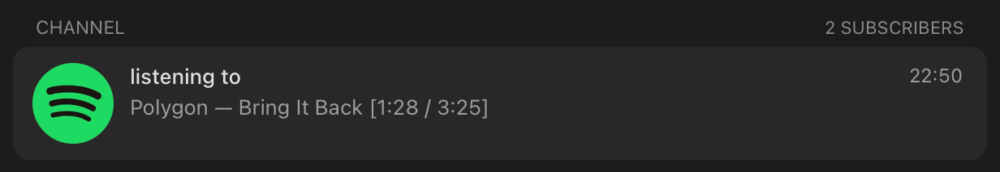

# spotify-tg-bio

Выводит текущий трек из Spotify в Telegram.  
Сделано по просьбе @omar1ck :D



## Сборка

Для сборки необходимо заполнить переменные окружения `SPOTIFY_CLIENT_ID` и `SPOTIFY_CLIENT_SECRET`.

```
$ cargo build --release
```

## Запуск

При первом запуске создаётся файл `config.json` с настройками.

| Параметр   | Описание                                                            |
| ---------- | ------------------------------------------------------------------- |
| `interval` | Интервал обновления в секундах                                      |
| `template` | Шаблон сообщения с текущим треком. [Подробнее](#переменные-шаблона) |
| `default`  | Сообщение, когда ничего не играет                                   |
| `telegram` | Настройки для Telegram (см. ниже)                                   |

### Настройки Telegram

Содержат поле `type` со значением `bio` или `channel`.

1. `bio`

| Параметр   | Описание                                                    |
| ---------- | ----------------------------------------------------------- |
| `api_id`   | API ID для Telegram API [отсюда](https://my.telegram.org)   |
| `api_hash` | API Hash для Telegram API [отсюда](https://my.telegram.org) |

2. `channel`

| Параметр     | Описание                                                     |
| ------------ | ------------------------------------------------------------ |
| `token`      | Токен бота для Telegram API [отсюда](https://t.me/BotFather) |
| `channel_id` | ID канала в Telegram (начинается с -100)                     |
| `message_id` | ID сообщения в канале, в котором будет изменяться текст      |

### Переменные шаблона

| Переменная   | Описание                           |
| ------------ | ---------------------------------- |
| `{artist}`   | Имена исполнителей через запятую   |
| `{title}`    | Название трека                     |
| `{progress}` | Текущая позиция в секундах (mm:ss) |
| `{duration}` | Длительность в секундах (mm:ss)    |
